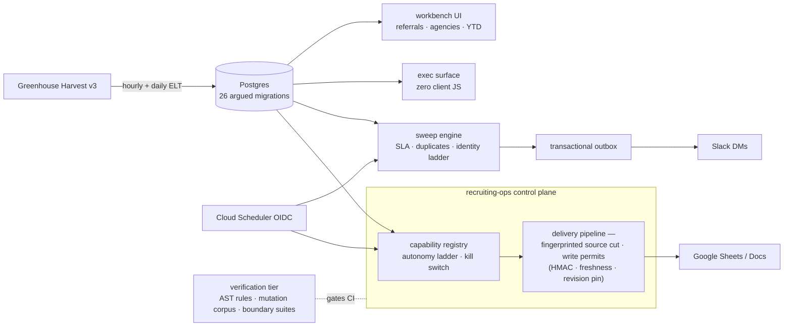

# Recruiting Analytics Platform

Greenhouse-to-Postgres ELT, SLA sweeps, identity resolution, permit-gated Google Workspace automation, and executive dashboards — with a verification tier that is itself production code.

Recruiting operations in most organizations run on manual weekly reporting: someone pulls the ATS into spreadsheets on a cadence, by hand, and the team runs on those spreadsheets. The pipeline drifts, breaks silently, and concentrates in one person's head. The usual replacement — a dashboard nobody opens — fails for the opposite reason: it moves the data away from where the team actually works. This platform takes a third path. It automates the pipeline end to end, and it delivers the results *into the team's existing Sheets and Docs*, under write permits, so the artifacts people already trust keep updating after the person who maintained them stops.

---

## Shape

Three concentric layers.

The **surface** is a thin Next.js App Router app — five dashboard routes and roughly thirty HTTP handlers — that holds no business logic. Operator-facing workbench views (referrals, agencies, year-to-date) render from Postgres; an executive state-of-play surface renders server-side with zero client JavaScript.

The **domain** lives in `lib/`: the ELT that pulls Greenhouse Harvest v3 into Postgres on hourly and daily schedules, SLA sweeps over the result, an identity-resolution ladder for recruiters and agencies, a transactional notification outbox that lands in Slack, and the recruiting-ops control plane — the delivery pipeline that hydrates governed Google Workspace artifacts.

The **verification tier** treats the first two layers as its subject: an AST architecture checker with a behavioral suite proving each rule actually fires, boundary suites that spawn subprocesses over the real repository, a mutation corpus proving the suites bite, and a quarantined red-spec runner for audited-but-unfixed behavior.



---

## Writing into someone else's spreadsheet, safely

The riskiest thing this system does is mutate live documents the recruiting team runs on. The delivery pipeline is built around that risk.

Every write travels under a **structural write permit**: an HMAC-signed grant naming the exact target, pinned to a document revision, expiring on freshness. The source data is cut and fingerprinted before planning, so what was approved is what gets written; a revision that moved between plan and write voids the permit rather than clobbering someone's edit. Recurring sheets carry rollover lifecycles — a pipeline rollover recognizes its own finished work rather than re-running it — and the ELT document writer can insert a missed week anywhere in the governed archive, certify the post-image, and roll it back.

Capabilities climb an **autonomy ladder** — shadow mode first, writing nothing while recording what it would have written, then trust periods, then autonomy — with a kill switch above all of it. Several capabilities in this cut ship dormant by design: `RECOPS_SHADOW_ENABLED`, `RECOPS_EXEC_ENABLED`, and the notification send path default off. That is the deployment posture, not unfinished work — each turns on deliberately, per environment, after its trust period.

The registries encode a real migration story. The `T##`/`Q##`/`S##` identifiers map an inherited inventory of hand-kept workbooks — the spreadsheets a recruiting team actually ran on — and the control plane replaces them artifact by artifact, each deliverable bound to a governed write target with parity checks against the legacy copy it retires.

---

## Sweeps, identity, and honest alerts

The sweep engine reads the pipeline the way an operations lead would: which referrals are aging toward their SLA, which agency submissions collided with existing candidates, which duplicates need a human decision. Alerts route through a transactional outbox to Slack DMs, deduplicated per recipient and reason, so a retry cannot double-ping and a failed DM to one recruiter cannot drop another's.

Two design points here came from production incidents. The referral sweep originally fetched only applications created in the last 48 hours, while the breach threshold was also 48 hours — so an application aged out of the fetch at the exact moment it crossed into breach, and the breach tier was structurally unreachable. The census fetch (every active referral in Application Review on an open job, any age) closed it, and the alert ledger now records first-alerted only for items actually alerted, so an already-actioned item can never suppress a legitimate future alert. Identity resolution runs on a ladder — exact id, then email, then constrained name matching — because Greenhouse lists the same human under different identities across endpoints, and a wrong merge is worse than an unresolved one: unresolved rows surface as defects rather than silently landing in a sentinel bucket.

---

## The verification tier

This is the part of the repository that took the most engineering judgment, and it gates everything else in CI.

The **architecture checker** (`npm run check:recruiting-ops-architecture`) is an AST-level rule engine over the real codebase — module boundaries, forbidden imports, fingerprints over the write path — and it comes with a behavioral suite that mutates a scratch copy of the repo to prove every rule actually fires. A rule that cannot fail is decoration; each of these demonstrably can.

The **mutation corpus** (`npm run test:mutation`) seeds known-bad edits and requires that an existing test catches every one. It answers the question a green board cannot: would the suite notice?

The **boundary suites** derive their file set from `git ls-files` and spawn subprocesses over the repository itself, so they verify the tree as committed rather than a mocked image of it. (They need a git working tree — a tarball export would pass emptily, which is why CI runs them post-checkout.)

The **red-spec quarantine** (`npm run test:red`) holds specs for audited behavior that is not yet fixed. CI asserts the red suite currently *fails by assertion* — a red spec that passes means the fix landed and the spec moves to the green board; one that fails to load is a build error. The backlog reaching empty is the goal state, and it was reached: every audited population was fixed and its spec promoted.

The monitoring directory is written the same way: each alert policy in `docs/recruiting-ops/monitoring/` is checked in beside the outage narrative it closes — including the scheduler-authorization defect in which every route compared the short Cloud Scheduler job id against the full resource path, so the scheduled hydration run had been rejected with HTTP 400 on its only lifetime fire and had never once started. The fix accepts both forms; the test now supplies the shape production actually sends.

---

## Stack

| Layer | Choice |
|---|---|
| Runtime | Node 24, TypeScript strict, Next.js App Router, React 19 |
| Data | Postgres (Supabase), 26 hand-written SQL migrations with argued headers, no ORM |
| External | Greenhouse Harvest v3 (OAuth2), Google Sheets/Docs/Drive, Slack Web API, Resend |
| Scheduling | Cloud Scheduler with OIDC service-account verification; shared-secret fallback for local runs |
| Deploy | Dockerfile → Cloud Run (standalone output) |
| Tests | Vitest, plus the architecture checker, mutation corpus, boundary suites, and red-spec runner |

Scheduled endpoints verify the caller twice: the OIDC token's service-account identity against a pinned expectation, and the environment's declaration against the same compiled constant — deploying a fork means editing both, on purpose. The placeholder identities in this public cut (`example-project`, synthetic Drive ids, `U00000000001` Slack ids) mark every value a deployment must supply.

---

## Running it

```bash
npm ci
cp .env.example .env.local   # Supabase, Greenhouse, Slack, Google credentials
npm run dev
```

Migrations live in `supabase/migrations/` and apply in filename order with the Supabase CLI (`supabase db push`) or any SQL runner. The credential-free verification tier runs without any of it:

```bash
npm run typecheck
npm test                                  # green board (excludes test/red)
npm run check:recruiting-ops-architecture
npm run test:mutation
npm run test:red                          # must fail by assertion when non-empty
```

Environment knobs beyond `.env.example`: `EMPLOYEE_REFERRAL_CORPORATE_EMAIL_DOMAIN` (recipient domain gate for referral reports), `SWEEP_HEAD_OF_TA_SLACK_ID` and `SWEEP_RECRUITING_OPS_ALERT_SLACK_ID` (alert routing), and the per-deployment scheduler identities documented in `app/api/cron/`.

---

## Status

The platform ran in production against a live ATS: the ELT, sweeps, referral reporting, exec surface, and the permit-gated delivery pipeline all operated on real hiring data on a schedule. This repository is a fresh public cut of that system — one commit, with tenant identifiers, live document ids, and personal data replaced by shaped placeholders so every code path still exercises.
